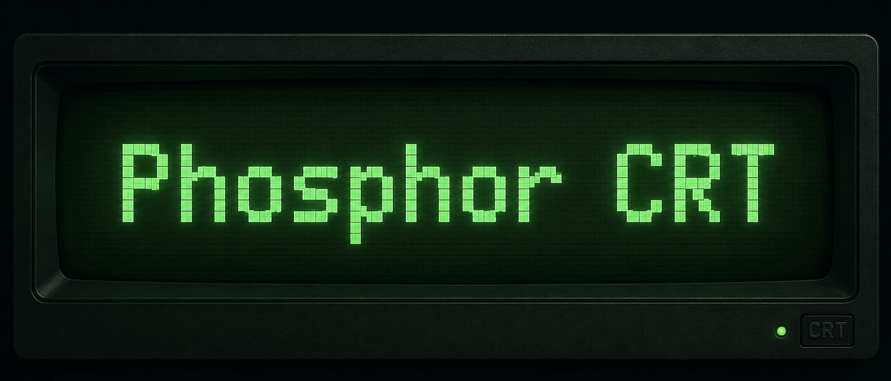

A Retro 80s sci-fi CRT theme for Zed IDE. A striking and nostalgic combination of Green phosphor UI and an amber CRT style terminal.

## Preview

[Phosphor CRT Screenshot](assets/screenshot-1.png)

## About

Emulate vintage CRT monitors. UI: green phosphor (bright `#7FFFF2` text on `#001F1F` bg). Terminal: amber phosphor (`#FED146` fg on `#160F00` bg). Dark theme named "Combo CRT".

## Install

Clone repo to `~/.config/zed/extensions/phosphor-displays`. Restart Zed. Select "Combo CRT" theme (Cmd+K, Cmd+T).
